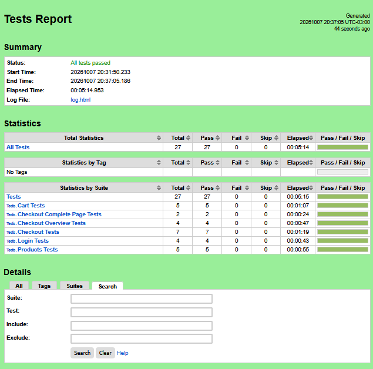

# Testes automatizados do SauceDemo com Robot Framework

Este projeto contém testes automatizados de interface (UI) da aplicação [SauceDemo](https://www.saucedemo.com/), desenvolvidos com Robot Framework e SeleniumLibrary, com o objetivo de validar seus principais fluxos funcionais.

## Tecnologias e Ferramentas utilizadas

- **Linguagem:** Python 3.12
- **Navegador:** Mozilla Firefox
- **Framework de Automação:** Robot Framework v7.5
- **Biblioteca:** SeleniumLibrary

## Estrutura do projeto

```text
josewolf-robot-framework/
├── resources/
│   ├── base.resource
│   └── pages/
│       ├── login_page.resource
│       ├── products_page.resource
│       ├── cart_page.resource
│       ├── checkout_page.resource
│       ├── checkout_overview_page.resource
│       └── checkout_complete_page.resource
├── tests/
│   ├── login_tests.robot
│   ├── products_tests.robot
│   ├── cart_tests.robot
│   ├── checkout_tests.robot
│   ├── checkout_overview_tests.robot
│   └── checkout_complete_page_tests.robot
├── requirements.txt
└── README.md
```

- **resources/base.resource:** centraliza os recursos utilizados pelas suítes e o início/fim das sessões de teste.
- **resources/pages/**: contém as keywords e os elementos relacionados a cada página da aplicação.
- **tests/**: contém as suítes e os cenários de teste automatizados.
- **requirements.txt:** contém as dependências necessárias para executar o projeto.

## Pré-requisitos

Antes de executar o projeto, é necessário ter instalado:

- Python 3.12
- Git
- Mozilla Firefox
- pip

## Como executar o projeto

### 1. Clonar o repositório

```bash
git clone https://github.com/jose-wolf/josewolf-robot-framework.git
cd josewolf-robot-framework
```

### 2. Criar e ativar o ambiente virtual

#### Linux

```bash
python3 -m venv .venv
source .venv/bin/activate
```

#### Windows — PowerShell

```bash
python -m venv .venv
.venv\Scripts\activate
```

#### Windows — Git Bash

```bash
python -m venv .venv
source .venv/Scripts/activate
```

### 3. Instalar as dependências

```bash
pip install -r requirements.txt
```

### 4. Executar os testes

Para executar todos os testes:

```bash
robot -d results tests/
```

Para executar somente uma suíte específica:

```bash
robot -d results tests/login_tests.robot
```

## Cenários cobertos

### Login

| ID | Cenário | Tipo | Resultado esperado |
| --- | --- | --- | --- |
| LOGIN-001 | Realizar login com credenciais válidas | Positivo | Usuário acessa a página de produtos |
| LOGIN-002 | Realizar login com senha incorreta | Negativo | Sistema exibe mensagem de erro de autenticação |
| LOGIN-003 | Realizar login sem username | Negativo | Sistema informa que o username é obrigatório |
| LOGIN-004 | Realizar login sem password | Negativo | Sistema informa que o password é obrigatório |

### Produtos

| ID | Cenário | Tipo | Resultado esperado |
| --- | --- | --- | --- |
| PROD-001 | Adicionar um item ao carrinho | Positivo | Contador do carrinho é atualizado para 1 |
| PROD-002 | Adicionar múltiplos itens ao carrinho | Positivo | Contador do carrinho é atualizado para 2 |
| PROD-003 | Visualizar detalhes de um produto | Positivo | Informações e preço do produto são exibidos corretamente |
| PROD-004 | Ordenar produtos do menor para o maior preço | Positivo | Produto de menor preço aparece primeiro |
| PROD-005 | Acessar catálogo diretamente sem login | Negativo | Sistema bloqueia o acesso e exige autenticação |

### Carrinho

| ID | Cenário | Tipo | Resultado esperado |
| --- | --- | --- | --- |
| CART-001 | Validar produtos adicionados ao carrinho | Positivo | Produtos selecionados aparecem no carrinho |
| CART-002 | Remover um produto do carrinho | Positivo | Produto é removido e o contador é atualizado |
| CART-003 | Remover todos os produtos do carrinho | Positivo | Carrinho fica vazio |
| CART-004 | Retornar à vitrine pelo Continue Shopping | Positivo | Usuário retorna à página de produtos |
| CART-005 | Acessar carrinho diretamente sem login | Negativo | Sistema bloqueia o acesso |

### Checkout — Informações

| ID | Cenário | Tipo | Resultado esperado |
| --- | --- | --- | --- |
| CHECKOUT-001 | Avançar com dados válidos | Positivo | Usuário é direcionado para Checkout: Overview |
| CHECKOUT-002 | Cancelar checkout | Positivo | Usuário retorna ao carrinho |
| CHECKOUT-003 | Continuar sem First Name | Negativo | Sistema informa que First Name é obrigatório |
| CHECKOUT-004 | Continuar sem Last Name | Negativo | Sistema informa que Last Name é obrigatório |
| CHECKOUT-005 | Continuar sem Postal Code | Negativo | Sistema informa que Postal Code é obrigatório |
| CHECKOUT-006 | Continuar com formulário vazio | Negativo | Sistema apresenta mensagem de campo obrigatório |
| CHECKOUT-007 | Acessar checkout diretamente sem login | Negativo | Sistema bloqueia o acesso |

### Checkout — Overview

| ID | Cenário | Tipo | Resultado esperado |
| --- | --- | --- | --- |
| OVERVIEW-001 | Validar subtotal, taxa e valor total | Positivo | Valores calculados são apresentados corretamente |
| OVERVIEW-002 | Finalizar uma compra | Positivo | Usuário é direcionado para a confirmação do pedido |
| OVERVIEW-003 | Cancelar pedido no overview | Positivo | Usuário retorna à página de produtos |
| OVERVIEW-004 | Acessar overview diretamente sem login | Negativo | Sistema bloqueia o acesso |

### Checkout — Complete

| ID | Cenário | Tipo | Resultado esperado |
| --- | --- | --- | --- |
| COMPLETE-001 | Validar confirmação da compra e retornar à vitrine | Positivo | Mensagem de sucesso é exibida e usuário retorna aos produtos |
| COMPLETE-002 | Acessar página de confirmação diretamente sem login | Negativo | Sistema bloqueia o acesso |

## Relatórios

Após a execução dos testes, o Robot Framework gera os arquivos de resultado na pasta `results/`.

Os principais arquivos são:

- `results/report.html`: apresenta o resumo da execução dos testes.
- `results/log.html`: apresenta os detalhes das suítes, cenários e keywords executadas.
- `results/output.xml`: contém os resultados da execução em formato XML.

Para visualizar os resultados, abra `report.html` ou `log.html` em um navegador.

## Evidência de execução

A suíte completa possui atualmente **27 testes automatizados**.

Resultado da última execução:

- **27 testes executados**
- **27 testes aprovados**
- **0 testes reprovados**



## Próximos passos

- Expandir a cobertura de testes automatizados.
- Adicionar novos cenários conforme a aplicação evoluir.
- Avaliar novos fluxos e casos negativos.
- Evoluir a execução do projeto em diferentes ambientes.

## Autor

**José Wolf**

[LinkedIn](https://www.linkedin.com/in/jose-wolf/)
